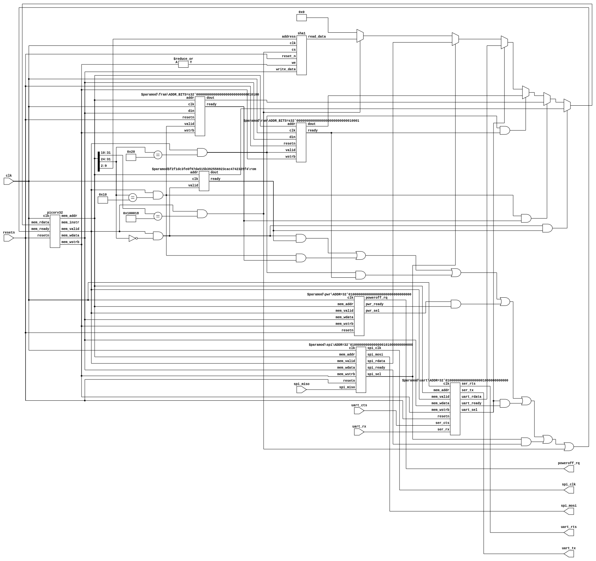

# Hardware-Root-of-Trust

Verilog implementation of Hardware-Root-of-Trust with firmware

TODO :

1. Authenticated Boot Loader Verification
2. Anti Rollback Prevention
3. Secure restore


## Sign the Firmware with openSSL

Generate key pair

RSA

```shell
cd fw/sign

# Generate 4096-bit RSA private key and extract public key
openssl genrsa -out key.pem 4096
openssl rsa -in key.pem -pubout > key.pub
```
Sign the firmware

```shell
openssl dgst -sign key.pem -keyform PEM -sha256 -out otp.mem.sign -binary otp.mem
hexdump -e '4/1 "%.2x" "\n"' otp.mem.txt > signature.mem
hexdump -e '4/1 "%.2x" "\n"' key.pub > pubkey.mem
cat pubkey.mem sign.mem ../opt.mem > signed.mem
```

## SoC block diagram


